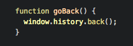
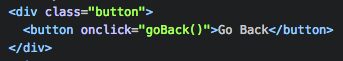
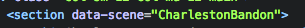
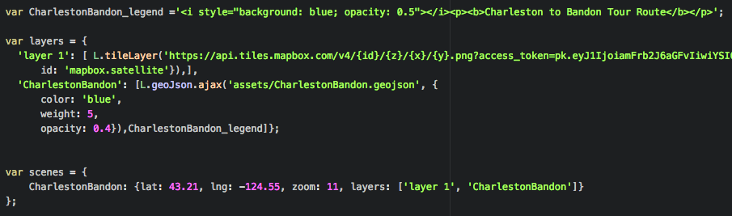
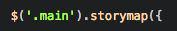
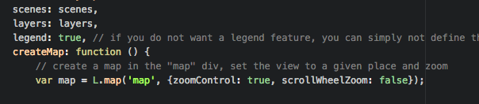
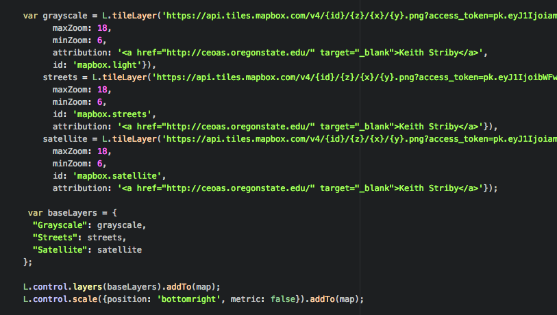
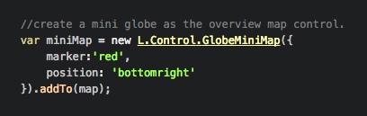
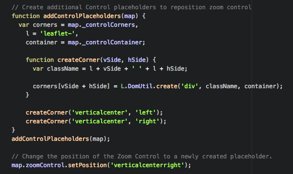
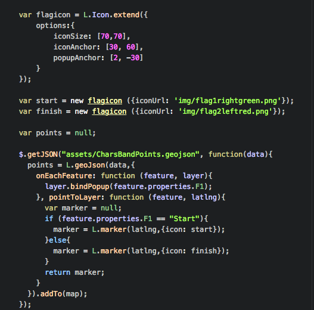

# Scenic Byways of Western Oregon

> Winter 2017 | Geography 371 | Geovisualization: Web Mapping
>
> Author: Keith Striby

## 1. Overview

For the final web mapping project, my topic is on Scenic Byways in Western Oregon. Routes that were selected
are shown in the Oregon Scenic Byways Driving Guide, made through the partnership of the Federal Highway
Administration, the Oregon Department of Transportation, and the Oregon Tourism Commission. The text
descriptions of the routes used in the driving guide was written by Chris Santella, and was summarized and
used on my webpage. This guide has declared four types of routes: All-American Roads, National Scenic Byways,
Oregon State Scenic Byways, and Oregon Tour Routes. 

## 2. Data

The data obtained for the webpage was from the United States Geological Survey on their National Map site. One
download of three shapefiles contained nearly all of the roads in Oregon. Unfortunately, each of the three
shapefiles would contain different segments of road of the same road, so quite of bit of time was required
using ArcMap. To make the selections of routes even more difficult, the majority of roads that were labeled in
the attribute table were only interstates, U.S. highways, and state highways. So when you see a route that
wonders from a highway, it required a unique process of selecting and trimming to make the byways you see.
Once all of the routes and their respective start and finish points had their own shapefile, the data was then
processed through QGIS, and a GeoJSON file was made for use on the web maps. 

## 3. Baselayers

The utilization of multiple baselayers was an important feature for my web maps to have due to the type of
data being displayed and its intended use. When I do research on day trips, weekend trips, or vacations there
isn’t a limit to the amount of information that I want about where I’m inquiring about. So being able to see
aerial imagery was an important baselayer to have on my web map. That way a viewer can see actual physical
details of where they’re traveling. Another important baselayer is one that contains topographical
information, especially when traveling to a new place. Terrain information is important for viewers because of
the types of vehicles that are traveled in, and the unpredictable roads and conditions that occur in Oregon.
For the third baselayer I utilized one that contains none of the previous information described. After being
capable of seeing the last two types of information, it is important to just see points, lines, and polygons
to not distract the viewer of just a plain route that you can see on a traditional road map.  MapBox provided
the three baselayers utilized. 

## 4. Map Elements

The map elements utilized on my web maps are what I consider the bare minimum. Due to having multiple
baselayers, a control to switch between the three was required and is in the upper-right corner of the map.
Below this is a legend displaying the color of the route and the route’s name.  For viewers to thoroughly
inspect their prospective routes I added zoom control, but disabled the scroll-wheel on the map. For viewers
who may not be familiar with the location of the map’s extent, a globe is provided so that this is
unambiguous. Underneath that is the map’s scale for the current zoom level. 
Interactive elements involved with the web maps are the changing of the three baselayers, and the point
markers on the maps. The map initially displays satellite imagery of the map’s extent, and the two other
baselayers are capable of being toggling between. For the selection of baselayers to show, the mouse is
required to be hovered over the layers icon in the upper-right corner of the map. The markers on the map
represent the start and finish locations of their respective route. When the user clicks a point marker on the
page, the indication of the marker being a start or finish location will appear above it. 

## 5. Data Delivery

The data regarding the routes and their associated points is served to the user via individual GeoJSON files.
Mostly this was done to keep the construction of the webpage a little simpler for me during the school term.
After preparing some of the data for a previous lab, the line data was not an excessive amount of bytes for
the user to upload and view the map.

## 6. Functionality Summary

The first function utilized is for returning to the previous part of the page the user was once on. First the
function in JavaScript is: 

	

This code is then connected to the functionality of the button with the following in HTML: 

	

With this following code in HTML:

	

The following JavaScript code is connected to the HTML page for displaying the map. The CharlestonBandon scene
variable is tied to the HTML code, therefore tying its layer and legend variables to it as well.

	

The following function contains the remainder of the story map functionality, and houses the remaining
functions. The dollar function refers to an element in the Document Object Model, and in this case, “.main.”

	

Here the details of the story map are set, enabling scenes, layers, and legend. Then a function createMap
houses the following code. A map variable is then placed in it, and tied to the map div. Zoom control is
enabled, and scroll wheel zoom is disabled. 

	

Here the three baselayers are declared with the L.titleLayer function. Then the variable baselayers houses
each variable for control, and then functionality for baselayer control is enabled with the L.control.layers
function. Finally, the map scale function places it in the bottom right, and sets units to SAE. 

	

Here the mini globe variable is set, and the details of its marker and position is customized. 

	

Here the location of zoom control on the map display is controlled. The control final position was then
adjusted using CSS. 
	
	

Then the flag icons used are extended so that two different ones may be used and customized using GeoJSON
data. 

	

## 6. Conclusion

This web mapping project was very difficult, but rewarding. Due to the nature of its data being associated
with exploring Oregon, this project is far from finished. While doing research on the theme of the website I
found a couple other sites that mine could soon be better than, after more work in the field and some
additional features to the web maps and webpage in general. The Leaflet features displayed on the web map
barely even scrape the surface of their JavaScript library for interactive maps. Once I am more comfortable
with JavaScript the web map features will be a fun and easy task to implement. This project will be a perfect
source for me to showcase various Computer Science and Geographical Information Science disciplines for future
employers. After employing more technical features on the website regarding Handlebars.java, databases, and a
web feature service this site will become well rounded. 
